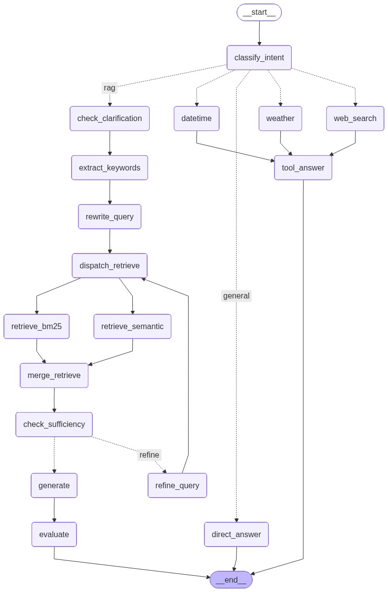

# doc-mind

Intelligent Document QA API built with FastAPI.

## Prerequisites

- Python 3.12+
- `curl`
- Docker (optional)

## Installation (UV)

1. Install UV:

```bash
curl -LsSf https://astral.sh/uv/install.sh | sh
```

2. Ensure UV is on your PATH (current shell):

```bash
export PATH="$HOME/.local/bin:$PATH"
```

3. Install dependencies from the project root:

```bash
uv sync
```

4. Create environment file:

```bash
cp .env.example .env
```

## Run Locally

Use UV to run the app with Uvicorn:

```bash
uv run uvicorn app.main:app --host 0.0.0.0 --port 8000 --reload
```

App URLs:

- API: `http://localhost:8000`
- Swagger docs: `http://localhost:8000/docs`
- Health: `http://localhost:8000/health`
- Readiness: `http://localhost:8000/ready`

## Run with Docker

Build image:

```bash
docker build -t doc-mind:local .
```

Run container:

```bash
docker run --rm -p 8000:8000 --env-file .env doc-mind:local
```

## Development Notes

- Project dependencies are managed via `pyproject.toml` + `uv.lock`.
- Route registration is done in `app/main.py` by including `common_route` from `app/routes`.
- Both ingest and query requests now require a raw `user_id`. Documents are stored in a shared collection/database and filtered by that `user_id` at retrieval time.

## API Notes

Ingest documents for a user:

```bash
curl -X POST http://localhost:8000/ingest \
	-F 'user_id=demo-user' \
	-F 'files=@/path/to/document.pdf'
```

Query only that user's documents:

```bash
curl -N -X POST http://localhost:8000/query \
	-H 'Content-Type: application/json' \
	-d '{"user_id":"demo-user","question":"What does the document say?","max_iterations":3}'
```

## Architecture

Doc-Mind is an intelligent document QA system built on **FastAPI** and **LangGraph**. It ingests documents, builds a hybrid search index, and answers natural-language questions with a multi-step agentic RAG pipeline.



### High-Level Overview

```
User ──► FastAPI ──► LangGraph Agent Pipeline ──► Streaming SSE Response
              │
              ├── /ingest  → Document Processing → Chunking → Embedding → ChromaDB + BM25
              └── /query   → Intent Classification → Retrieval / Tool → Generation → Evaluation
```

### Project Structure

```
app/
├── main.py                 # FastAPI application factory, middleware, lifespan
├── core/
│   ├── config.py           # Pydantic settings (env-driven configuration)
│   └── logging.py          # Structured logging setup
├── database/
│   ├── chroma.py           # ChromaDB persistent vector store (cosine similarity)
│   └── bm25_store.py       # BM25 keyword index (in-memory corpus store)
├── llm/
│   ├── google_model.py     # Google GenAI (Gemini) streaming LLM wrapper
│   └── embedding_model.py  # FastEmbed (BAAI/bge-small-en-v1.5) ONNX embeddings
├── rag/
│   ├── graph.py            # LangGraph state-graph assembly and conditional edges
│   ├── nodes.py            # All pipeline node implementations
│   ├── state.py            # RAGState TypedDict (full pipeline state schema)
│   ├── prompts.py          # System prompts for each LLM-powered node
│   ├── tools.py            # Built-in tools: web search, weather, datetime
│   └── evaluator.py        # RAGAS evaluation node (faithfulness, relevancy, precision)
├── routes/
│   ├── ingest.py           # POST /ingest — upload & process documents
│   ├── query.py            # POST /query — streaming SSE RAG pipeline
│   ├── common.py           # Health & readiness probes
│   └── ui.py               # Minimal web UI
├── templates/
│   └── ui.html             # Browser-based chat interface
└── utils/
    ├── document_processor.py   # Format router (PDF, DOCX, MD, TXT)
    ├── pdf_processor.py        # PDF parsing (text, tables, images with bounding boxes)
    ├── docx_processor.py       # DOCX parsing
    └── chunker.py              # Recursive text splitting, table→Markdown, image→LLM description
```

### Document Ingestion Pipeline

1. **Upload** — The `/ingest` endpoint accepts one or more files (PDF, DOCX, DOC, MD, TXT) along with a `user_id`.
2. **Processing** — Each file is routed to its format-specific processor. PDFs are parsed into ordered blocks (text, tables, images with bounding boxes).
3. **Chunking** — Text blocks are split with recursive character splitting (configurable `CHUNK_SIZE` / `CHUNK_OVERLAP`). Tables are converted to Markdown as atomic chunks. Images are described by the LLM and then chunked.
4. **Embedding** — Chunks are embedded locally using **FastEmbed** (`BAAI/bge-small-en-v1.5`, ONNX runtime — no external API calls).
5. **Storage** — Embeddings are upserted into **ChromaDB** (persistent, cosine similarity). The raw text is also indexed in a **BM25 corpus store** for keyword retrieval. All chunks are tagged with the `user_id` for multi-tenant filtering.

### Query Pipeline (LangGraph Agent)

The query pipeline is a **LangGraph state graph** that processes each question through a series of nodes with conditional routing. The entire flow streams progress and LLM tokens to the client via **Server-Sent Events (SSE)**.

```
__start__
    │
    ▼
classify_intent ──┬── "rag"       → full RAG pipeline (see below)
                  ├── "web_search" → DuckDuckGo search → tool_answer → END
                  ├── "weather"    → wttr.in lookup → tool_answer → END
                  ├── "datetime"   → current date/time → tool_answer → END
                  └── "general"    → direct LLM answer → END
```

#### RAG Sub-Pipeline

When the intent is `rag` (i.e. the question is about uploaded documents), the following nodes execute:

| Step | Node | Description |
|------|------|-------------|
| 1 | **extract_keywords** | LLM extracts key terms and decides retrieval depth (`top_k`, clamped 3–20) |
| 2 | **rewrite_query** | LLM rewrites the question for optimal dense-vector retrieval |
| 3 | **dispatch_retrieve** | Fans out to parallel retrieval branches |
| 4a | **retrieve_semantic** | Cosine-similarity search against ChromaDB embeddings |
| 4b | **retrieve_bm25** | BM25 keyword search against the in-memory corpus |
| 5 | **merge_retrieve** | Deduplicates and merges results from both branches |
| 6 | **check_sufficiency** | LLM judges whether retrieved context covers the question |
| 7a | **refine_query** *(if insufficient)* | LLM generates a refined follow-up query and picks search mode (keyword / semantic / hybrid); loops back to `dispatch_retrieve` |
| 7b | **generate** *(if sufficient)* | LLM produces the final answer grounded in retrieved chunks |
| 8 | **evaluate** | RAGAS computes reference-free metrics: faithfulness, answer relevancy, context precision |

The sufficiency loop runs up to `max_iterations` times (configurable per request), progressively refining the query until the LLM deems the context adequate.

### Key Technology Choices

| Component | Technology | Why |
|-----------|-----------|-----|
| **API Framework** | FastAPI | Async-first, auto-generated OpenAPI docs, SSE streaming support |
| **Agent Orchestration** | LangGraph | Declarative state graph with conditional edges, parallel fan-out, and loop support |
| **LLM** | Google Gemini (GenAI) | Streaming content generation with retry/backoff for transient errors |
| **Embeddings** | FastEmbed (ONNX) | Local inference, no API key needed, fast and lightweight |
| **Vector Store** | ChromaDB | Persistent on-disk storage, cosine similarity, metadata filtering |
| **Keyword Search** | BM25 (in-memory) | Complements semantic search for exact-match and acronym queries |
| **Evaluation** | RAGAS | Reference-free metrics logged to `rag_evaluations.jsonl` for offline analysis |
| **Streaming** | SSE (Server-Sent Events) | Real-time token-by-token delivery and pipeline stage progress to clients |

### Multi-Tenancy

Documents are stored in a shared ChromaDB collection and BM25 index. Each chunk is tagged with the uploader's `user_id`. At query time, retrieval filters by `user_id` so users only search their own documents.
